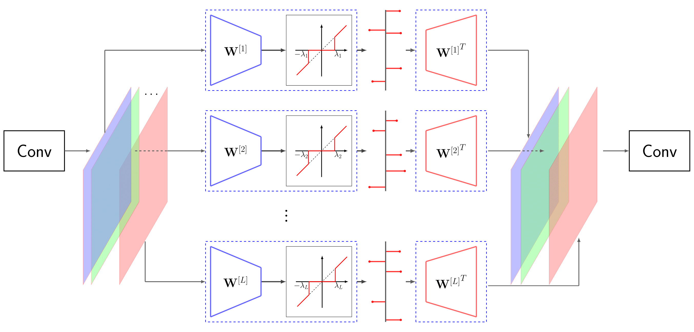
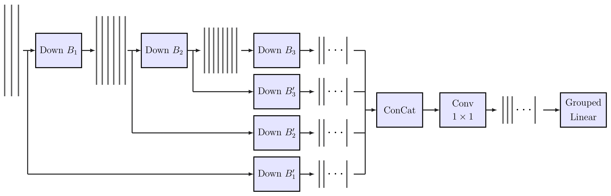
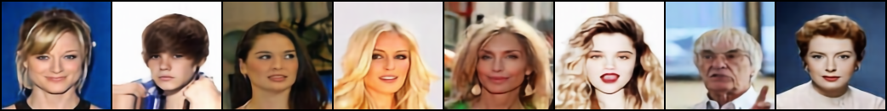
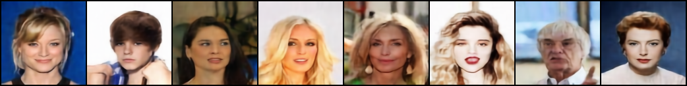
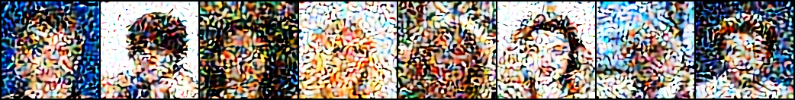
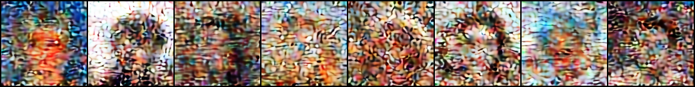

# Sparsifying groups for image ambiguation:

The PyTorch implementations and materials for our ICASSP'20 paper titled:  "[Privacy-preserving Image
sharing via sparsifying layers on convolutional groups](https://arxiv.org/abs/2002.01469)".

In short, we present a privacy-aware but very practical image sharing mechanism using a convolutional
autoencoder that we tailor to provide ambiguation on sparse codes. Unlike traditional image obfuscation
schemes that are based on ad-hoc manipulations of some image parts and only on individual images, we present a more general scheme that learns
how to efficiently ambiguate the privacy-sensitive content by adapting to the whole database.

There are two main themes to this work: 1) Presenting a privacy-aware image sharing scheme, and 2) equipping convolutional neural networks with
sparsity in their representations which can be useful for a variety of other tasks.

## Privacy-preserving image sharing:

Imagine a scenario where a large number of high resolution images are to be shared, stored and
communicated with several different entities. For many applications, these images, however, may contain privacy-sensitive
content and some of the entities involved may be curious about these content, and hence not trustworthy.

In such scenarios, particularly when the images have large sizes, the cost of ensuring safe communication
by e.g., direct encryption of the images may be prohibitively large.


Our general idea is to judiciously add some ambiguation noise to image representations such that the
adversarial parties may not be able to discern meaningful information. From the other hand, the trusted
entities/users are provided with the keys to faithfully disambiguate the images they are provided access
to. We then pay the price of security, only for these short keys and not the entire images.


Note that in order for this idea to be useful, the disambiguation keys should be very compact compared to
the original size of the images. For example, merely shuffling the image pixels is not a useful idea,
because the size of the key to de-shuffle the images would be even more than the images themselves.

## Relation to image compression:


As was just mentioned, a basic requirement of this idea, and an important measure of merit for an algorithm to be successful
is the compactness of the keys. Therefore, this problem is tightly related to image compression. However, standard image compression codecs are
not suitable for our purpose. Firstly, there is no mechanism to add such ambiguation in the bit-streams. More
importantly, since the representation bases of these codecs are independent from the data (e.g.,
DCT in JPEG or DWT in JPEG2000), by analyzing the active coefficients of several similarly-looking
images (e.g., a database of facial images), an adversary can guess some information about the content of
these images.


This implies the need for a learning-based approach. We propose to learn representations such that the
adversary cannot infer any meaningful statistics from the images. This is the case because an algorithm
that is trained to maximally compress the size of representations while retaining as much useful content about
the images as possible will necessarily spread out the representations, leaving no trace of the original
statistics. Moreover, it has been shown in the literature of the line of work of **learning to
compress**, that deep learning based solutions can outperform traditional image codecs in terms of the
efficiency of the compression. While we adopt this strategy, we still have another requirement: Apart from compactness of the
representations, we furthermore need them to be sparse. Otherwise, on dense (and possibly binarized) representations, we are
not able to efficiently add ambiguation. This, however, is not addressed in the literature.

## Imposing sparsity on bottleneck codes of convolutional autoencoders:

While the literature of signal processing is very well-motivated and rich in terms of sparse representations, deep learning algorithms fall short in this respect. Firstly, sparisity is not an immediate requirement of popular learning algorithms. Secondly, from the architectural point of view, it is not straightforward to achieve this in practice. There are two major reasons behind this:

Firstly, usual non-linearities used in deep learning architectures like the ReLu, tanh, sigmoid and their different variants are not sparsity inducing. From the other hand, sparsity inducing operators in signal processing (e.g., the hard-thresholding or soft-thresholding operators) cannot guarantee highly sparse representations. The reason is that by picking large thresholds, some inputs may end up having no activities at all. So one should reduce the threshold leading to lower sparsities. Moreover, it is not very well shown in the literature whether this choice will slow-down training compared to the ReLu.


Secondly, for large images, it is highly preferable to use fully-convolutional designs, rather than fully-connected linear layers. However, the output of convolutional filters are highly correlated. When trying to impose sparsity directly on these representations, most of the non-zero activities will be concentrated in certain places rather than being spread out across all coefficients.

We overcome these two limitations accordingly as follows:

1. Instead of element-wise non-linearities, we use a non-linearity that depends on all coefficients. For each given input, this non-linearity keeps the **top-k** elements with largest magnitudes and suppresses the rest. So each input example ends up having exactly k non-zero coefficients out of a larger m. Across different experiments, we did not notice any optimization issues compared to the ReLu. This is implemented in this repository as ``Tools.KBest``. The use of this non-linearity is well-motivated in [this PhD thesis](https://arxiv.org/abs/1901.08437).

2. We use **sparsifying linear layers on convolutional groups** in the bottleneck layer of our autoencoder as depicted in Fig. 1. Similarly to using convolutional filters in groups which reduces the number of parameters, we use linear layers independently after each convolutional filter, and control the number of filters using 1-by-1 convolutions. This major consequence of this design is that the linear layer used to alleviate sparsity does not have to be a very large one, but multiple tiny ones. This makes things practical even for very large images since the number of parameters, as well as the chance of over-fitting are drastically reduced. This repository implements this under ``Tools.groupedLinearEncoder`` and ``Tools.groupedLinearDecoder`` classes for the encoder and the decoder sides, respectively.




## The network architecture:

With the above grouped linear layer in the center, as well as several convolutional and residual blocks, the general structure of the encoder looks like the following:



The decoder will simply mirror the encoder to reconstruct the final image. Note that the encoder results in a group of latent sparse codes, rather than a single dense code. We notice that, as a result of somehow independent training encouraged by the linear groups, each code-map governs a different aspect of the image. Interestingly, these different characteristics sometimes happen to be also semantically meaningful. This is also a consequence of concatenation of the outputs of the convolutional filters. We notice that using summation instead of concatenation will result in a very different formation of code-maps.

As far as the loss function for reconstruction is concerned, here we simply use the binary cross entropy loss. One could alternatively use other losses, even under adversarial training recipes of GANs.

## Some sample results:

We use the CelebA database of 128-by-128 facial images. This database contains around 200K images and is considered relatively large-scale. We randomly shuffle 80% of the database for training and test our algorithm on the other split.

What if these images were privacy-sensitive? Our algorithm provides the following results:


    

               

            

                  



The first row shows some random samples from the test split. The second and third rows show what an access-granted user can recover safely from these images, and with two different utility budgets. The forth row shows what an access-denied user can decipher from these images. Note that the ambiguation noise added to these sparse values looks exactly like the true non-zero values. So an adversary should make nchoosek(256, 128) guesses to reconstruct the original image, a huge combinatorial number! If s/he was to randomly keep 128 values and suppress the other 128 values, the adversary would get something similar to the images in the fifth row.

Here the true sparsity was 128, out of 512 coefficients and there were 20 of these code-maps. The storage cost of this key is about 1 KBytes, which is very practical for secure communication or encryption. Otherwise a JPEG-compressed image with similar reconstruction quality is much larger than this.

## Attacks:

Can this system be attacked in a computationally efficient manner? This is a very interesting direction to consider for future research. In particular, one may ask the question how to use SGD and an image prior to guide the learning algorithm to solve the combinatorial guessing problem.


## Logistics:

Tested with PyTorch ``version = 1.0``. Also requires OpenCV to load images. To evaluate the reconstruction quality based on psnr and ssim, skimage library is used.

``trainGround.ipynb`` is used to train and save the network. This is then invoked in ``noiseLab.ipynb``, where ambiguation noise is added and the quality of reconstruction is tested.


## Citation:

Here is how to cite this work:

```
@inproceedings {ICASSP20_Privacy,
    author = { Ferdowsi, Sohrab and Razeghi, Behrooz and Holotyak, Taras and P. Calmon, Flavio and Voloshynovskiy, Slava },
    booktitle = { IEEE Int. Conference on Acoustics, Speech and Signal Processing (ICASSP) },
    title = {Privacy-preserving image sharing via sparsifying layers on convolutional groups},
    year = { 2020 },
    note = "[\url{https://arxiv.org/abs/2002.01469}]"
}
```
